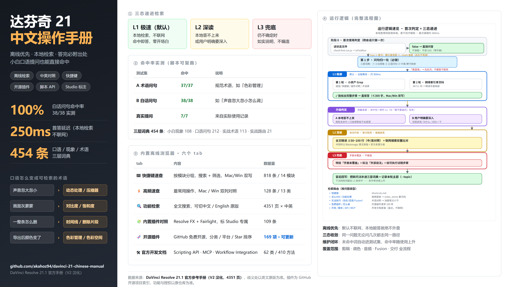
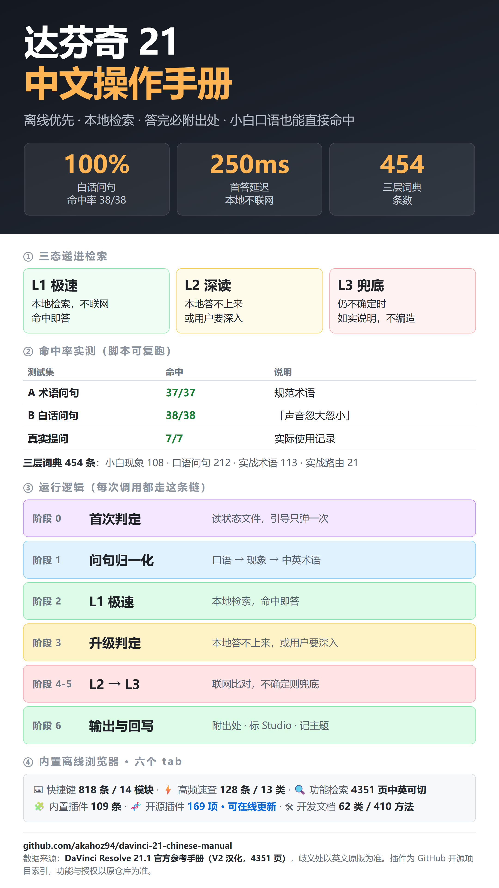
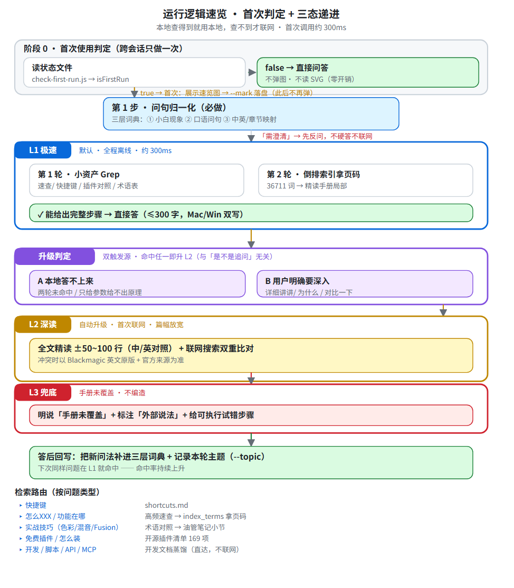

# 达芬奇 21 中文操作手册（DaVinci 21 Chinese Manual）

> 原文汉化：**@谜一样的剪辑师** ｜ 收集整合：**@一个成熟的剪辑猿** ｜ 开源协议：**MIT**

一个**离线、自包含**的 DaVinci Resolve 21.1 中文操作手册。它同时是两种东西：

1. **给 AI 助手（WorkBuddy 等）检索用的 Skill** —— 你问达芬奇操作问题，AI 先检索这份资料、在对话框里直接中文回答，需要时再调出可视化界面。
2. **给人类直接浏览 / 搜索的可视化网页** —— 双击 `references/手册浏览器.html` 即可离线使用，无需联网、无需服务器。

数据来自 **DaVinci Resolve 21.1 官方参考手册（V2 汉化，2026 年 9 月）**（4351 页）。汉化有歧义/缺失时以 Blackmagic Design 英文原版 21.1 Reference Manual 为准。

> 📌 当前版本：**v2.14**（宣传图出 PC 横版 16:9 / 移动竖版 9:16 两版排版，成品像素严格精确）
> 📖 版本演进：**[CHANGELOG.md](CHANGELOG.md)** ｜ 🧠 使用思路：**[使用思路.md](使用思路.md)**

---

<p align="center">
  
</p>

<details>
<summary>📱 手机上放大看 —— 竖版 9:16（1080×1920，内容同上）</summary>

<p align="center">
  
</p>

</details>

---

## 核心特性

| | |
|---|---|
| 📴 **完全离线** | 单文件浏览器 17.5MB 自包含；skill 全量本地蒸馏，**默认不联网** |
| ⚡ **三态递进** | L1 极速（本地 ≤2 轮 Grep，~300ms）→ L2 深读（联网双重比对）→ L3 兜底（明说未覆盖） |
| 🎯 **面向小白** | 三层问句归一化词典，**真实白话问句命中率 100%**（38/38） |
| 🔌 **169 项开源插件** | GitHub 免费开源 DCTL/OFX/Fuse/VST3 + 四类安装路径表 |
| 📚 **六 tab 浏览器** | 快捷键 / 高频速查 / 全文检索(中·英) / 插件中英对照 / 开源插件 / 开发文档 |
| 📖 **4351 页全文** | 可搜索、可切中文汉化 ⇄ English 原版对照 |
| 🚀 **首次只弹一次** | 跨会话判定「首次」，状态文件在 git 仓库外，skill 更新/重装不丢 |
| 🔁 **维护闭环** | 词典改动 → 75 条问句回归测试 → 真实问句覆盖检查 |

---

## 检索架构

### 阶段 0 · 首次使用判定（跨会话只做一次）

「首次」的依据是 **该用户是否曾调用过本 skill**，不是「每个新会话」。

```bash
node scripts/check-first-run.js         # 只读探测
node scripts/check-first-run.js --mark  # 展示引导后才标记
```

- `isFirstRun: false` → **不弹图、不读 SVG**，直接问答（零开销）
- `isFirstRun: true` → 展示速览图 → `--mark` 写入状态
- 状态文件：`~/.workbuddy/skills/.state/达芬奇21中文操作手册.json`（**在 git 仓库外**，skill 更新/重装/clone 都不丢）
- 边界：文件删除 / JSON 损坏 → 恢复首次；目录只读 → 引导照常展示但不阻塞问答

### 阶段 1~6 · 三态递进（运行逻辑速览）



> 完整六阶段流程图见**顶部宣传图右栏**。矢量源文件：[`flow-overview.svg`](references/flow-overview.svg)｜[`flow-detailed.svg`](references/flow-detailed.svg)


---

## 命中率实测

| 测试集 | 归一化前 | 归一化后 |
|---|---|---|
| 规范术语问句 | 61.5% | **100%**（37/37） |
| **真实小白白话** | **39.5%** | **100%**（38/38） |
| 真实使用主题（`recentTopics`） | — | **100%**（持续累积） |

> 回归测试内置 75 条真实问句，词典改动后必跑：
> ```bash
> node scripts/hitrate-test.js
> ```

三层词典解决三类缺口：

| 层 | 文件 | 解决什么 | 例 |
|---|---|---|---|
| ① | `小白现象词典.txt`（108） | **只说现象、描述不清** | 「一会大一会小」⇥ 动态处理/压缩器<br>「灰扑扑」⇥ 一级校色/对比度 |
| ② | `口语问句映射.txt`（212） | **动词短语命中不了名词索引** | 「怎么导出」⇥ Deliver<br>「怎么混音」⇥ 音频 |
| ③ | `实战术语对照.txt`（113） | **英文术语没中文化** | `texture pop` ⇥ 纹理凸起 |

含一组**「需澄清」条目**（"就那样""不知道怎么说"）→ 命中即反问用户，不硬答不联网。

---

## 离线浏览器（六个 tab）

`references/手册浏览器.html` — 单文件 17.5MB，数据全内联，离线即用。

| tab | 内容 | 数据量 |
|---|---|---|
| ⌨ **快捷键速查** | 按模块分组，搜索 + 模块筛选；Mac/Win 双写 | 818 条 / 14 模块 |
| ⚡ **高频速查** | 最常用操作，Mac / Win 双列对照 | 128 条 / 13 类 |
| 🔍 **功能检索** | 4351 页全文，**顶部可切中文汉化 / English 原版对照** | 4351 页 × 中英 |
| 🧩 **内置插件中英对比** | Resolve FX + Fairlight 音频插件，标「是否 Studio 专属」 | 109 条 |
| 🧬 **开源插件** | GitHub 免费开源插件，**搜索 / 分类 / 平台 / Star 排序** | **169 项** |
| 🛠 **官方开发文档** | Scripting API · MCP · Workflow Integration，表格化 + 折叠 | 62 类 / 410 方法 |

**开源插件 tab** 数据源：[akahoz94/hoz-davinci-plugins](https://github.com/akahoz94/hoz-davinci-plugins) ｜ 在线可搜：https://hoz.jianjimi.cn/

分类：脚本/MCP 56 · DCTL 调色 47 · AI 25 · OFX 22 · Fusion 15 · 编码器 4

---

## 实战技巧蒸馏（YouTube 讲师）

`references/实战技巧蒸馏-油管博主.md` — 六位英文 DaVinci 讲师的**技术要点**蒸馏，含定位对比、按视频章节/参数、「按问题找谁」路由表：

| 讲师 | 方向 |
|---|---|
| **Cullen Kelly** | 色彩科学（色彩管理三层次、ACES vs RCM、Look 开发、HDR/Dolby Vision） |
| **Casey Faris** | 零基础全链路（4h+ 入门课、Fusion Zero to Hero） |
| **Darren Mostyn** | 广播级实战调色（色彩匹配、固定节点树、D-Log M、DRT vs CST） |
| **MrAlexTech** | Fusion 快速技巧（免关键帧动画、常见故障） |
| **Team 2 Films** | 系统课与转软件（Premiere/FCP → Resolve、色彩管理、Fusion VFX） |
| **Jason Yadlovski** | Fairlight 音频（Complete Fairlight Audio Course 作者） |

> 边界：基于公开章节列表 + 评测/官方简介整理，**非逐字稿**；具体参数以原视频为准，与手册冲突以手册/英文原版为准。

---

## 21.1 / 21.1.1 脚本 API

`references/官方开发文档蒸馏.md`（121KB）：

- **§1.2 环境与授权（重要）**：21.1 起**免费版彻底失去 Python/Lua 脚本能力**（官方称 Python API 被滥用于把 Studio 功能 hack 进免费版）、**Python 2 移除**、**内置 Python 3.14**（`import DaVinciResolveScript` 开箱即用，无需设环境变量；但该解释器不支持 pip/Tk/IDLE）。
- **§8 版本与变更**：21.1 关键变化 + 约 20 个新 API 速查 + **原生 MCP Server（Studio）**；§8.3 收录 21.1.1 增量（Async API 家族 + `ApplyGradeFromDRX`）。
- **后半**：从官方 `.pyi` 自动提取的完整 API 参考（62 类 / 410 方法 / TypedDict 字段 / 41 组常量枚举）。

---

## 目录结构

```
达芬奇21中文操作手册/
├── SKILL.md                      # AI 检索规则（三态递进 + 路由 + 硬约束）
├── 使用思路.md                   # 使用思路梳理 + 设计决策理由 + 自我审计记录
├── CHANGELOG.md                  # 版本演进
├── README.md
├── 宣传页横版.png / 宣传页竖版.png # 宣传图成品：PC 1920×1080（16:9）/ 移动 1080×1920（9:16）
├── 宣传页横版.html / 宣传页竖版.html # 宣传图构建源（改这个再重新截图）
└── references/
    ├── 手册浏览器.html            # 六 tab 单文件离线浏览器（17.5MB）
    ├── flow-overview.svg           # 运行逻辑速览图（矢量 680×780，首次激活展示）
    ├── flow-overview.png           # 同上 PNG 版（GitHub 展示用）
    ├── flow-detailed.svg          # 完整流程图（矢量 680×1330，六阶段，见宣传图右栏）
    ├── flow-detailed.png          # 同上 PNG 版
    │
    ├── # 归一化词典（检索前必过）
    ├── 小白现象词典.txt            # 白话现象 → 规范术语（108 条）
    ├── 口语问句映射.txt            # 口语问句 → 核心检索词（212 条）
    ├── 实战术语对照.txt            # 中英术语 → 章节（113 条）
    ├── 实战路由表.txt              # 中文关键词 → 章节（75 条）
    │
    ├── # 结构化数据（Grep 优先）
    ├── 高频速查.md / quickref.json # 128 条 / 13 类
    ├── shortcuts.md               # 818 条 / 14 模块
    ├── index_terms.txt            # 36711 词倒排索引（每词一行）
    ├── chapters.txt               # 262 条章节目录
    ├── Resolve_FX中英对照.md      # 77 条
    ├── Fairlight音频插件.md        # 32 条
    ├── 官方开发文档蒸馏.md         # 121KB · 62 类 / 410 方法
    │
    ├── # 全文与实战
    ├── 21.1原文检索.txt            # 4351 页中文（Grep 友好）
    ├── 21.1英文原文检索.txt        # 4351 页英文原版
    ├── 实战技巧蒸馏-油管博主.md     # 六位 YouTube 讲师技术要点
    ├── 开源插件清单.md              # 169 项 + 四类安装路径表
    │
    └── index.json                 # 旧版索引（⚠️ 71万字符单行，agent 请勿 Grep）
```

---

## 快速开始

### 给 AI 助手用
安装到 skill 目录后直接提问即可，例如：
- 「怎么调速」
- 「人声太吵怎么办」
- 「有没有免费的抠像插件」
- 「TimelineItem 怎么设速度」

### 人类浏览
双击 `references/手册浏览器.html`，六个 tab 离线即用。

### 重新生成宣传图

改完宣传页 HTML 后重新截图（需本机已装 Chrome）：

```bash
node scripts/shot-promo.js 宣传页横版.html 宣传页横版.png
node scripts/shot-promo.js 宣传页竖版.html 宣传页竖版.png
```

| 参数 | 说明 |
|---|---|
| 第 1 参 | 源 HTML（相对 skill 根目录） |
| 第 2 参 | 输出 PNG；省略则与 HTML 同名 |
| 第 3 参 | 视口宽度（可选，默认读 `body` 实际宽度） |
| 第 4 参 | 视口高度（可选，默认读 `body` 实际高度） |

- **路径自动推断**（基于脚本自身位置），从任何目录运行都可以；也可用 `SKILL_ROOT` 环境变量指定根目录。
- Chrome 路径自动探测多平台；非默认安装位置可用 `CHROME=/path/to/chrome` 指定。
- 脚本会**等所有嵌入图加载完再截图**，并报告有无加载失败的图。
- 宣传图必须是 **PNG** —— GitHub 图片代理（camo）不渲染 SVG。
- 同一份内容出**两版排版**：横版给 PC / README，竖版给手机与社媒。README 只嵌横版，竖版收在折叠块里，避免两张大图重复占位。
- **尺寸是硬指标**：两个 HTML 都用 `body{width;height;overflow:hidden}` 定死 1920×1080 / 1080×1920，脚本默认按 `body` 实际高度截图（**不加余量**），成品像素必须正好是 3840×2160 / 2160×3840。改动后请用 PIL 复核真实像素，别只看脚本打印的 CSS 值。

### 更新插件数据源
见 [使用思路.md · 维护指引](使用思路.md)。

---

## 与其他 skill 的关系

- 本 skill 是**达芬奇操作的官方逻辑知识库** —— 后续接入 DaVinci MCP 时，所有回答与操作以 21.1 手册逻辑为准。
- `达芬奇中文操作手册` 仅作补充归档。

---

## 免责声明

原文版权归 Blackmagic Design 所有，本项目仅作离线查阅 / 歧义对照。插件清单由 AI 辅助整理自 GitHub 公开仓库，**不代表任何背书或推荐**；安装前请读源仓库 README / Issue 确认兼容版本，并**备份好工程文件与数据库**。多数 MCP / 脚本类工具需 Studio 版（免费版不开放脚本接口）。

---

**仓库地址**：https://github.com/akahoz94/davinci-21-chinese-manual
